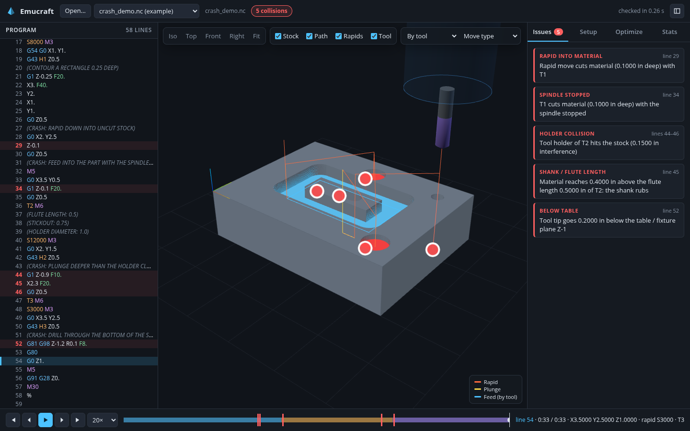
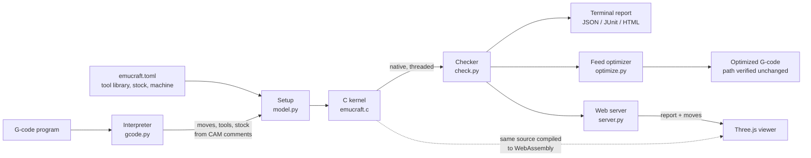

# Emucraft

Emucraft simulates a 3-axis G-code program against the stock, tool, shank and
holder, and tells you whether it will crash before the program reaches the
machine. It is fast enough to run on every program in CI, can rewrite feeds
to slow down in corners and heavy cuts (useful for titanium and Inconel), and
comes with a web viewer built on Three.js.



```console
$ emucraft check examples/crash_demo.nc
FAIL  5 collisions
  x line 29          rapid-cut        Rapid move cuts material (0.1000 in deep) with T1
  x line 34          spindle-off-cut  T1 cuts material (0.1000 in deep) with the spindle stopped
  x lines 44-46      holder           Tool holder of T2 hits the stock (0.1500 in interference)
  x line 45          shank            Material reaches 0.4000 in above the flute length 0.5000 in of T2: the shank rubs
  x line 52          table            Tool tip goes 0.2000 in below the table / fixture plane Z-1
```

## Quick start

Requirements: Python 3.9+ and a C compiler (the kernel is compiled on first
use). There are no other runtime dependencies.

```sh
pip install -e .                          # or run `python -m emucraft` from a checkout
emucraft check examples/makino_roughing.nc
emucraft serve --open                     # viewer on http://127.0.0.1:8765
emucraft optimize examples/pocket_corners.nc --material titanium
```

## How it fits together



- **Interpreter** (`emucraft/gcode.py`) turns Fanuc-style programs (PowerMill,
  Fusion 360, Mastercam and similar posts) into one continuous path of
  straight moves. Arcs (IJK or R, any plane, helical) become chords within
  0.0002". It handles canned cycles, G91, G52, G53/G28 retracts, dog-leg
  rapids, macro variables and expressions, and `G4 X` dwells. `G65` calls and
  `IF` blocks are skipped with a warning, never executed as moves. Tool and
  stock data are read from CAM header comments (`DIAMETER:`,
  `Tool Holder Diameter:`, `MIN X:` ...), from `#127`/`#128` holder and
  stick-out variables, and from your config file. Anything it cannot
  simulate faithfully becomes a message instead of a silent guess.
- **Kernel** (`kernel/src/emucraft.c`) models the stock as a height field and
  sweeps each move analytically. For every cell under a move it finds the
  lowest point of the moving tool surface (flat, ball, bull nose or
  drill/chamfer), so long moves cost no more than short ones. Shank and
  holder cylinders are checked in the same pass, split into "before the
  cutter reaches this cell" and "after it leaves". The file is freestanding
  C99: the same source builds as a native library (Python, multithreaded by
  row bands) and as a 20 KB WebAssembly module for the browser. A test
  proves the two produce bit-identical results.
- **Checker** (`emucraft/check.py`) runs the kernel and adds path-level
  checks. It groups kernel events into issues with line ranges, positions
  and depths, and estimates cycle time.
- **Viewer** (`emucraft/web/`) replays the same moves through the WASM kernel.
  The height field is a GPU texture updated in place (only the rectangle the
  kernel touched is uploaded each frame) and drawn by a displacement shader,
  so playback and scrubbing are smooth even for large programs.

## What gets checked

| Issue | Meaning |
|---|---|
| `rapid-cut` | A rapid (G0, G28/G53 retracts, canned-cycle rapids) removes material |
| `spindle-off-cut` | Material is removed while the spindle is stopped (M5, after M6, before M3) |
| `shank` | Material taller than the flute length is cut: the shank rubs. Also a shank wider than the cutter touching the stock |
| `holder` | The holder cylinder (`holder_diameter`, bottom at `stickout` above the tip) touches the stock, including stock left beside the cut |
| `table` | The tip goes below the table / fixture plane (default: the stock bottom) |
| `link-cut` | A feed move at or above `link_feed` (high-feed "fly" links) removes material (warning) |
| `travel` | The path leaves the machine travel limits, if configured |
| `tool` | A tool is used for cutting but its geometry is unknown |

The interpreter also reports program problems: arcs whose end point is off
the circle, feed moves without F, unsupported codes (G68, G51, G43.4 ...),
tool length offset H not matching the tool (`G43 H1` with T20), undefined
macro variables, and more.

The model is 2.5D: the stock is a height field seen from +Z. Undercuts,
4th/5th axis and cutter compensation offsets are out of scope (G41/G42 paths
are simulated as tool-center paths and reported). Several work offsets are
simulated as one setup. Numbers without a decimal point (`X1`) are read as
whole units, as on controls with decimal-point input enabled. When no stock
size is given anywhere, it is estimated from the cutting moves (with a
warning), which can put the stock top too high if a feed move starts in air.

## Jobs with several programs

CAM systems often post one file per toolpath. A finishing program checked on
a fresh block reports rapids into pockets that the roughing program had
already cleared. `--chain` checks the programs in order on one shared stock:

```sh
# alone, the finishing program's rapid into the pocket hits solid stock: FAIL
emucraft check examples/pocket_finish.nc
# after the roughing program, the pocket is already cleared: both PASS
emucraft check --chain examples/pocket_corners.nc examples/pocket_finish.nc
```

With `--html`, each report starts from the stock the earlier programs left
behind.

## Feed optimization

```sh
emucraft optimize part.nc -o part.opt.nc --material inconel
```

Two rules; where both apply, the slower feed wins:

- **Corners.** The cutting path's direction is measured over a short window
  (default a quarter of the tool diameter), so a sharp corner and a tight arc
  made of many tiny segments are both found. The feed drops to
  `corner_factor` (scaled by how sharp the corner is) within `corner_zone`
  tool diameters before and after it.
- **Tool load.** The simulation measures how much material every short piece
  of the path removes. Where the material removal rate goes above
  `load_limit` × the tool's typical cut (inside corners, full-width slots,
  rest material), the feed is lowered to hold that rate. Ramps and plunges
  that are already programmed slowly are left alone.

Presets (`aluminum`, `steel`, `stainless`, `titanium`, `inconel`) are starting
points; every value can be set on the command line, in the viewer's Optimize
tab or in `[optimize]` of the config. Only F words change. Plain G1 lines are
split where a slow zone starts or ends; arcs and cycles get their slowest
feed. The modal feed is restored after each zone. The optimizer
re-interprets its own output and refuses to write it unless the path matches
the original exactly.

## Configuration

`emucraft check part.nc` uses an `emucraft.toml` (or `.json`) found next to
the program or in any folder above it; `-c` picks one explicitly. See
[`examples/emucraft.toml`](examples/emucraft.toml):

```toml
units = "inch"                 # units of the lengths in this file

[machine]
rapid_rate = 1200              # in/min, for cycle time
rapid_mode = "dogleg"          # rapids that move each axis at full speed
table_z = -1.0                 # lowest point the tip may reach

[check]
link_feed = 700                # feed moves this fast must not cut
resolution = 0.002             # cell size; default ~6 million cells

[tools.20]                     # fills in what the CAM post does not write
flute_length = 1.0
holder_diameter = 1.3
stickout = 1.4

[default_tool]
holder_diameter = 1.5
```

Tool values are applied in this order, later winning: program comments,
`[default_tool]` (only for fields the program does not set),
`[tools.N]`, then command-line or viewer overrides
(`--tool 20:holder_diameter=1.5` or `--tool '*:stickout=2'`). Reports show
where each value came from. Holder checks need both `holder_diameter` and
`stickout`.

## In CI

`emucraft check` exits with 0 when there are no collisions, 1 on collisions
or program errors (`--strict` also fails on warnings), and 2 on bad input.
It writes JUnit XML for test dashboards and a single-file HTML report with the
full interactive viewer (no server or network needed):

```yaml
# .github/workflows/gcode.yml in a repository of posted programs
name: G-code check
on: [push, pull_request]
jobs:
  check:
    runs-on: ubuntu-latest
    steps:
      - uses: actions/checkout@v4
      - uses: actions/setup-python@v5
        with: { python-version: "3.12" }
      - run: pip install "emucraft @ git+https://github.com/amunchet/emucraft"
      - run: emucraft check programs/*.nc --junit junit.xml --html report.html
      - uses: actions/upload-artifact@v4
        if: always()
        with: { name: emucraft-report, path: "report*.html" }
```

## Performance

Measured on a 4-core container:

| Program | Check | Notes |
|---|---|---|
| `makino_roughing.nc` (3,126 lines, 0.375" end mill) | 0.3–0.4 s | 5.5 M cells at 0.0019", 4 threads; about 1 s for a whole `emucraft check` run including start-up |
| 200,000-line 3D ball-mill finish | 5.1 s | 5.5 M cells, 4 threads (11 s on 1) |
| Browser replay of `makino_roughing.nc` | 0.2 s | WebAssembly, 1.5 M cells |

The interpreter handles about 200,000 plain lines per second. The kernel
merges runs of nearly collinear moves (within half the event tolerance)
before sweeping, and runs row bands on all cores.

## Development

```sh
make -C kernel test        # C unit tests: sweeps against brute-force references
make -C kernel             # native library + WebAssembly (needs clang with wasm32/wasm-ld)
python -m pytest           # Python suite; WASM/native parity tests need Node.js
```

- `emucraft/web/wasm/emucraft.wasm` is committed so the viewer works without
  clang; rebuild it after changing `kernel/src/emucraft.c`.
  `tests/test_wasm_parity.py` fails if it drifts from the native build.
- `emucraft/web/vendor/three/` holds a minified single-file build of three.js
  r186 (MIT), so the viewer and HTML reports work offline.
- The viewer is plain ES modules with no build step.

The earlier prototypes (the Open3D renderers, the point-per-0.001" XYZ file
pipeline and the first kernel) were replaced by this implementation; they
remain in the git history before this change.
